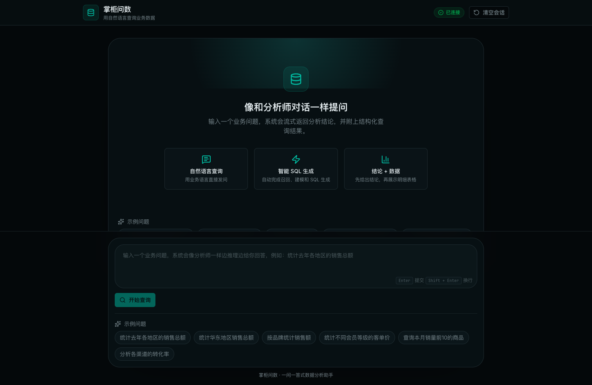
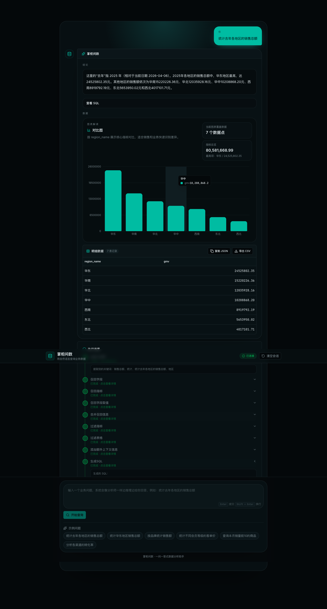
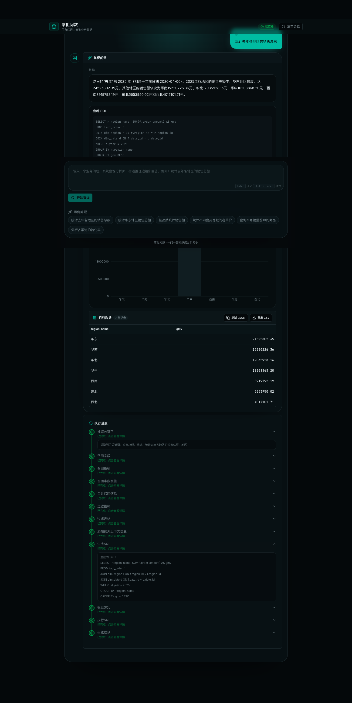
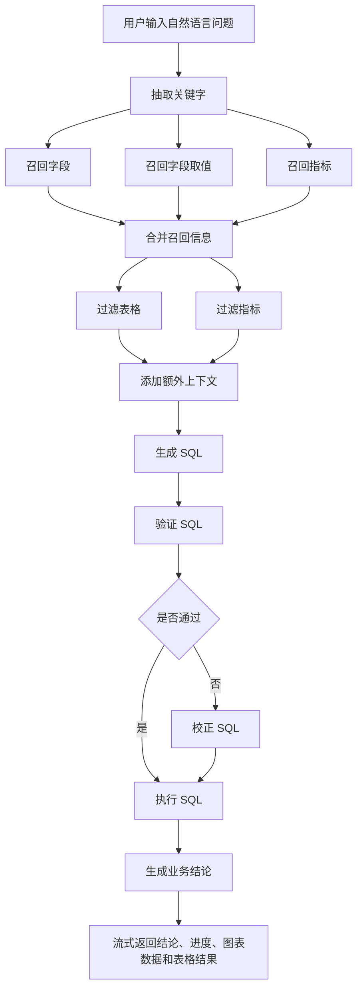

# NL2SQL Workspace

一个面向业务问数场景的中文 `NL2SQL` 项目工作区，包含：

- [data-agent](./data-agent)：后端智能体，基于 `FastAPI + LangGraph + MySQL + Qdrant + Elasticsearch`
- [data-agent-fronted](./data-agent-fronted)：前端对话式数据问答界面，支持流式结论、图表和执行进度详情

## 项目效果

### 首页



### 执行过程



### 结果展示



## 功能特性

- 一问一答式数据问答体验
- 流式返回结论，不只是表格结果
- 自动将结果渲染为图表和明细表
- 支持查看 Agent 执行进度，并可点击展开每一步的执行详情
- 支持相对时间解释，例如把“去年”明确解释成具体年份
- 内置较大规模的零售业务数据，可直接用于功能验证和效果展示

## 数据集

项目内已经保留了一套大规模零售业务数据，位置在 [data/retail_dw_large](./data-agent/data/retail_dw_large)。

默认规模：

- `21` 个地区
- `600` 个客户
- `120` 个商品
- `1186` 个日期
- `18000` 条订单事实

## Agent 执行流程



## 项目原理

这个项目不是把用户问题直接丢给大模型生成 SQL，而是把过程拆成多阶段可控链路：

1. 检索增强
   先从问题里抽取关键词，再分别去字段向量库、指标向量库和字段值全文索引中做召回，避免模型只靠记忆猜表和猜字段。

2. 结构化约束
   召回结果会被整理成候选表、候选字段、候选指标，并进一步过滤成最小必要上下文，再交给 SQL 生成节点，降低幻觉概率。

3. 时间与上下文补充
   在生成 SQL 前，会注入当前日期、数据库方言、版本等信息，并把“去年 / 今年 / 本季度”这种相对时间转成明确语义。

4. SQL 安全闭环
   生成 SQL 后不会直接执行，而是先做校验；校验失败时进入纠错节点，再重新验证，直到可执行。

5. 面向业务输出
   SQL 执行完成后，系统还会继续生成适合业务人员阅读的中文结论，同时把结果渲染成图表和明细表，而不是只返回原始数据。

## 核心架构

- 后端 API：`FastAPI` 提供 `POST /api/query`，通过 `SSE` 流式返回进度、结论和结果
- Agent 编排：`LangGraph` 组织多节点执行链路
- 元数据库：`MySQL(meta)` 存表、字段、指标元信息
- 业务数仓：`MySQL(dw)` 存零售业务事实表和维度表
- 语义召回：`Qdrant` 存字段和指标向量
- 取值召回：`Elasticsearch` 存字段值全文索引
- 前端：`Next.js + React + TypeScript`，以一问一答方式展示流式问数过程

## 目录结构

```text
NL2SQL/
├── data-agent/
│   ├── app/
│   ├── conf/
│   ├── data/
│   ├── docker/
│   └── prompts/
├── data-agent-fronted/
│   ├── app/
│   ├── components/
│   └── lib/
└── docs/
    └── screenshots/
```

## 快速启动

### 1. 启动后端基础设施和 Agent

```bash
cd /Users/bill/code/AI/NL2SQL/data-agent
docker compose up -d mysql qdrant elasticsearch
docker compose up -d agent
```

### 2. 启动前端

```bash
cd /Users/bill/code/AI/NL2SQL/data-agent-fronted
pnpm install
pnpm start --hostname 127.0.0.1 --port 3000
```

### 3. 访问页面

- 前端：[http://127.0.0.1:3000](http://127.0.0.1:3000)
- 后端健康检查：[http://127.0.0.1:8000/health](http://127.0.0.1:8000/health)

## 示例问题

- `统计去年各地区的销售总额`
- `统计华东地区销售总额`
- `按品牌统计销售额`
- `按会员等级统计客单价`

## 技术栈

- Backend: `FastAPI`, `LangGraph`, `SQLAlchemy`, `MySQL`, `Qdrant`, `Elasticsearch`
- Frontend: `Next.js`, `React`, `TypeScript`, `Tailwind CSS`, `Recharts`
- Model Access: `OpenAI-compatible LLM`, `OpenAI embeddings`
