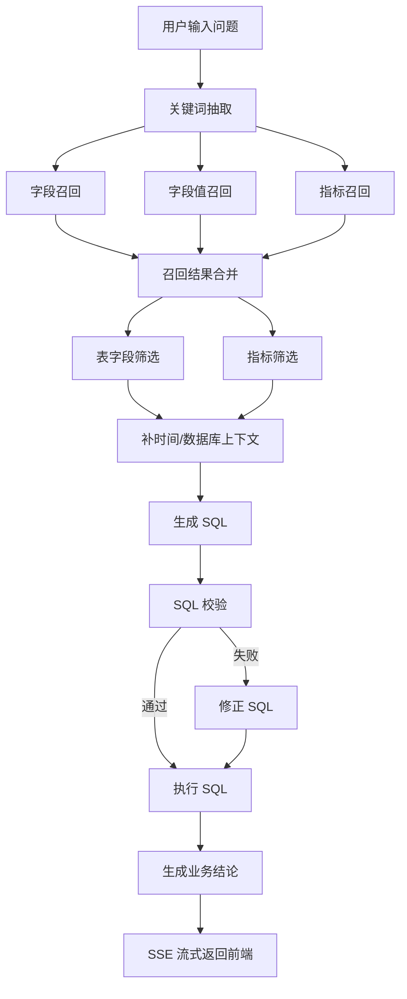

# NL2SQL 项目业务与面试介绍笔记

这份笔记的目标不是写成项目宣传稿，而是帮你在面试里把这个项目讲清楚，尤其是：

- 这个项目解决的业务问题是什么
- 为什么不能直接把问题丢给大模型生成 SQL
- 你在工程上做了哪些关键设计
- 面试官继续深挖时，怎么用口语化、可信的方式回答

---

## 1. 先用一句话定义这个项目

这是一个面向业务问数场景的中文 `NL2SQL` 系统。用户输入自然语言问题，系统会先做关键词抽取、字段/指标/字段值召回，再筛选上下文、生成 SQL、校验 SQL、执行 SQL，最后把结果总结成业务可读的中文结论，并通过前端流式展示整个过程。

更口语化一点可以说：

“这个项目本质上是在做一个面向业务人员的数据问答助手。用户不用会 SQL，只要说‘去年华东地区销售额最高的品类是什么’，系统就能把问题拆解、找到相关表和字段、生成并校验 SQL，最后把结果用人能看懂的话讲出来。”

---

## 2. 这个项目解决的业务问题是什么

### 2.1 业务背景

很多公司里，业务人员想看数据时会遇到几个典型问题：

1. 不会写 SQL  
   业务同学知道自己想问什么，但不知道数据表结构，也不知道 join 怎么写。

2. 数据口径复杂  
   比如“销售额”“客单价”“订单量”这些词，在业务上很常见，但在库里未必是同名字段，可能对应一套指标定义或者多个底层字段。

3. 时间表达天然是自然语言  
   用户会说“去年”“本季度”“最近一个月”，但数据库里要落成明确的时间过滤条件。

4. 直接让大模型生成 SQL 很不稳定  
   模型容易猜错表名、字段名、join 条件，最后 SQL 不是不能跑，就是跑出来的业务含义不对。

### 2.2 项目目标

这个项目的目标不是“展示一个模型会写 SQL”，而是做一个更接近真实业务系统的问数闭环：

- 能理解业务问题
- 能找到正确的表、字段、指标、字段值
- 能生成更可信的 SQL
- 能自动校验和修正 SQL
- 能把数据库结果翻译成业务结论
- 整个过程对用户可见，而不是黑盒

### 2.3 目标用户

- 业务分析同学
- 运营
- 销售管理
- 产品经理
- 需要临时查数、但不熟悉数据模型的人

---

## 3. 这个项目的业务流程，面试里应该怎么讲

建议按“用户视角 + 系统视角”来讲。

### 3.1 用户视角

用户输入一句话，例如：

`去年华东地区销售额最高的品类是什么`

系统会返回：

1. 执行中的步骤进度
2. 最终生成的 SQL
3. 查询结果表格
4. 一段业务可读结论

### 3.2 系统视角

从系统内部看，这个流程不是一步完成的，而是拆成了几个阶段：

1. 抽取关键词  
   从自然语言问题里抽出第一批检索词。

2. 多路召回  
   分别去召回：
   - 字段
   - 字段值
   - 指标

3. 合并和补齐上下文  
   把召回结果补成“候选表 + 候选字段 + 指标 + 字段取值示例”的结构化上下文。

4. 二次筛选  
   再让模型判断这次问题真正需要哪些表、哪些字段、哪些指标，减少噪声。

5. 补时间和数据库上下文  
   把“去年”“本季度”这类相对时间解析成具体时间，把数据库方言告诉模型。

6. 生成 SQL  
   基于筛选后的上下文生成 SQL。

7. 校验 SQL  
   用数据库侧校验方式判断 SQL 是否可执行。

8. 自动修正 SQL  
   如果报错，把错误信息、原 SQL、上下文一起给模型，让它做定点修复。

9. 执行 SQL  
   把 SQL 在数仓里真正跑起来。

10. 生成业务结论  
   把结构化结果翻译成业务人员能看懂的文字说明。

---

## 4. 为什么不能直接让大模型生成 SQL

这是面试里很高概率会被问到的问题。

### 4.1 标准回答

因为真实业务场景下，数据库结构、字段命名、指标口径和用户自然语言之间并不是一一对应的。  
如果直接让模型从一句话生成 SQL，它很容易出现三类问题：

1. 猜错表和字段
2. 指标理解错
3. join 和过滤条件写错

所以我没有走“纯 prompt 直出 SQL”的路线，而是先做检索增强和上下文收敛，再生成 SQL，这样稳定性会高很多。

### 4.2 更口语化的说法

“如果直接让模型裸写 SQL，它其实是在猜。问题是业务语言和库里的真实字段名经常对不上，比如用户说‘销售额’，库里可能叫 `amount`，也可能根本不是一个字段，而是一套指标定义。我的做法是先把相关字段、指标和值召回出来，再让模型在一个相对收敛的上下文里写 SQL，这样命中率会明显更高。”

---

## 5. 这个项目的核心设计亮点

### 5.1 多路召回，而不是单路召回

这个项目不是只召回字段，而是分成三路：

- 字段召回：解决“表里有哪些列可能相关”
- 字段值召回：解决“用户提到的华东/黄金会员/手机，可能是哪个字段上的值”
- 指标召回：解决“销售额/客单价/订单量这类业务指标到底对应什么”

这三路是互补的。

可以这样说：

“业务问题里通常既有实体值，也有业务指标，还隐含了要查哪些字段。单一路径很容易漏信息，所以我把召回拆成字段、值、指标三路，然后再合并。”

### 5.2 合并阶段不是简单拼接，而是业务补齐

`merge_retrieved_info` 是这个项目里很关键的一个节点。它做的事包括：

- 指标反补底层字段
- 字段值反补字段，并把值写到字段示例里
- 按表归组字段
- 补关键连接字段，降低 join 失败概率

可以这样说：

“合并阶段最重要的不是把三份结果拼起来，而是把它们补成一份 LLM 真正能消费的上下文。比如用户问到销售额，只召回到指标还不够，我还要把指标依赖的底层字段补进来；再比如只召回到‘华东’这个值，我也要反推出它大概率属于地区字段。”

### 5.3 SQL 生成后不是直接执行，而是做校验闭环

项目里把 SQL 执行拆成：

- 生成
- 校验
- 修正
- 执行

而不是生成完就直接跑。

可以这样说：

“我不把 LLM 输出直接当成可信 SQL，而是当成候选 SQL。先校验，失败就带报错去修，修完再执行。这样做的好处是，系统更像一个有保护措施的 agent，而不是一个直接下命令的黑盒。”

### 5.4 前端不是只展示结果，而是展示过程

前端不仅展示最终答案，也展示：

- 每个节点的进度
- 每步的 detail
- 流式 answer
- SQL
- 表格结果

这样做有两个价值：

1. 用户更信任系统
2. 开发排查更方便

可以这样说：

“我不想让用户只看到一个最后答案，因为问数链路里最怕黑盒。我把进度、细节、SQL 和最终结果都流式展示出来，既提高可解释性，也方便调试。”

---

## 6. 你在面试里可以怎么介绍这个项目

下面给你三个版本。

### 6.1 一分钟版本

“我做了一个中文 NL2SQL 项目，面向业务问数场景。用户输入自然语言问题后，系统不会直接让大模型写 SQL，而是先做关键词抽取，然后分别召回字段、字段值和业务指标，再把这些信息合并成候选上下文，进一步筛选后生成 SQL。SQL 生成完还会做校验，失败就带着报错自动修正，最后再执行并把结果总结成业务可读的中文结论。前端这边我做了 SSE 流式展示，把每个步骤、SQL 和结果都可视化出来，整体重点是把问数过程做成一个更稳定、可解释的链路。” 

### 6.2 三分钟版本

“这个项目解决的是业务人员不会写 SQL，但又经常需要临时查数的问题。  
核心难点在于，业务语言和数据库结构之间差了一层语义映射。比如用户说‘销售额最高的品类’，系统要知道‘销售额’是一个业务指标，‘品类’可能对应 `category_name`，‘华东’可能是 `region_name` 上的一个值，‘去年’还要转成具体年份。  

所以我的方案不是让模型一步到位写 SQL，而是把链路拆成多个节点。先用关键词抽取拿到初始检索词，再分别去做字段召回、字段值召回和指标召回。召回结果合并时，不是简单拼接，而是会把指标依赖字段补进来，把值命中的样例挂回字段，并且按表归组、补 key columns，给后面的 SQL 生成准备更完整的上下文。  

在 SQL 生成之后，我还专门做了校验和自动修正。如果数据库返回字段不存在、语法错误之类的问题，系统会把错误信息和原 SQL 一起喂给模型做修复，而不是直接失败。最后执行 SQL，再把结果总结成业务语言。前端这边用 SSE 流式接收进度和答案，让用户能看到整个执行过程。  

这个项目我想体现的重点不是‘模型能不能写出一条 SQL’，而是如何把一个不稳定的 LLM 能力，包成一个更工程化、更可控的业务系统。” 

### 6.3 十分钟深聊版本的结构

如果面试官让你展开，你可以按这个顺序讲：

1. 业务问题
2. 为什么直出 SQL 不够稳
3. 整体架构
4. 多路召回设计
5. 合并和筛选设计
6. SQL 校验与修复闭环
7. 前端流式展示
8. 效果、价值、局限

---

## 7. 面试时建议强调的“我的贡献”

如果这是你主导或深度参与的项目，建议把贡献讲具体，不要只说“我做了一个 NL2SQL 系统”。

可以拆成下面几类说：

### 7.1 架构贡献

- 设计了 LangGraph 多节点链路，而不是单 prompt
- 拆分出检索、筛选、生成、校验、修正、总结等节点
- 让系统从“模型试试看”变成“可控的执行流程”

### 7.2 检索与上下文设计

- 设计字段、字段值、指标三路召回
- 设计合并逻辑，把零散结果补齐成表级上下文
- 补关键连接字段，提升 SQL 生成稳定性

### 7.3 工程实现

- 后端用 `FastAPI + SSE` 输出流式过程
- 前端手写 SSE 解析，处理 chunk 边界
- 让前端能实时显示进度、答案和结果

### 7.4 可解释性和稳定性

- SQL 不是直接执行，而是先验证
- 失败时进入修正节点
- 用户能看到每一步在做什么

---

## 8. 高频面试问题，以及怎么口语化回答

下面这些问题，面试官非常可能会问。

---

## 8.1 这个项目最大的技术难点是什么？

### 回答思路

最大的难点不是“让模型生成 SQL”，而是“让生成过程稳定且可信”。

### 口语化回答

“我觉得最大的难点不是 prompt 怎么写，而是怎么把一个本来不太稳定的能力做成工程上可用的东西。真正难的是业务语言和数据库结构之间的映射，比如用户说的是‘销售额’‘华东’‘去年’，但数据库里是另一套表字段和时间条件。所以我最后的重点放在了检索增强、上下文收敛、SQL 校验修正这些环节，而不是只盯着生成那一步。”

---

## 8.2 为什么要做字段值召回？

### 回答思路

因为很多业务问题的关键信息不是字段名，而是字段值。

### 口语化回答

“因为用户很多时候不会说字段名，他会直接说值。比如他说‘华东地区销售额’，真正关键的信息其实是‘华东’。如果只召回字段，很可能只知道有个地区字段，但不知道用户这次到底要筛哪个值。加了字段值召回之后，系统能更稳地把‘华东’映射到 `region_name` 这类字段上。”

---

## 8.3 为什么要做指标召回？

### 回答思路

因为业务问题里经常是指标驱动，而不是字段驱动。

### 口语化回答

“用户通常不会说‘帮我 sum 一下 amount’，他说的是‘销售额’‘客单价’‘订单量’。这些词本质上是业务指标，不一定和单个字段一一对应。所以我单独做了指标召回，让系统先识别这次问题到底在问哪个业务口径，再去补相关字段。”

---

## 8.4 为什么合并阶段还要补 key columns？

### 回答思路

因为 join 能不能写对，很多时候取决于连接字段是不是在上下文里。

### 口语化回答

“这个点其实特别关键。上游召回很容易命中业务字段，比如销售额、品类、地区名，但真正写 SQL 的时候，模型还需要 join key，比如 product_id、region_id、date_id 这些。如果这些列不在上下文里，模型就容易瞎猜 join 条件。所以我在合并阶段专门把关键连接字段补进来，这对 SQL 成功率帮助很大。”

---

## 8.5 为什么不直接用 RAG，把 schema 全部喂给模型？

### 回答思路

全量 schema 上下文太大，而且噪声高。

### 口语化回答

“如果把整个 schema 全部喂给模型，一是上下文很大，二是噪声很多。模型看到太多不相关表和字段，反而更容易选错。我这里的思路是先召回，再过滤，把上下文收敛到最小必要集合。这样不只是省 token，更重要的是减少模型误判。”

---

## 8.6 你怎么保证 SQL 更安全？

### 回答思路

不要把 LLM 输出直接当最终答案。

### 口语化回答

“我不把 LLM 生成的 SQL 直接拿去执行，而是先走校验。校验失败的话，不是让用户自己看报错，而是把错误信息回灌给修正节点，让模型定点改。这个思路有点像给 agent 加了一个保护带，至少不会把第一版不靠谱 SQL 直接往数据库打。”

---

## 8.7 为什么前端要做流式展示？

### 回答思路

因为这个系统的核心价值之一是过程可解释。

### 口语化回答

“问数系统如果只给最终答案，用户其实很难信。尤其是 SQL 场景，大家会天然担心你是不是查错表了。所以我把每一步进度、细节、SQL、结果都流式展示出来。这样用户能看到系统到底在做什么，开发排查起来也快很多。”

---

## 8.8 你怎么处理 SSE chunk 边界问题？

### 回答思路

前端不能假设一次 read 就是一个完整事件。

### 口语化回答

“我前端没有偷懒直接按 chunk 解析，而是自己维护了一个 buffer。因为 SSE 事件是按 `\\n\\n` 分隔的，但网络分片不保证一次 read 就刚好收到一个完整事件。我的做法是先把 chunk 累到 buffer 里，再按事件块切分，最后把不完整的尾巴留到下一轮继续拼，这样解析会稳很多。”

---

## 8.9 如果让你继续优化，你会做什么？

### 口语化回答

“我会从三个方向继续做。第一是评估体系，把问题类型、SQL 正确率、结果正确率分开评估，不只看模型主观感觉。第二是把检索和筛选这块做得更细，比如加 rerank 或者更强的元数据约束。第三是把多轮追问做起来，比如用户问完‘去年华东销售额最高的品类’，接着问‘那第二名呢’，系统能继承上下文继续查。”

---

## 8.10 这个项目的局限性是什么？

### 口语化回答

“这个项目现在更适合结构相对清晰、元数据比较完整的数据域。它的上限很依赖元数据质量，尤其是字段描述、指标定义、字段值索引这些。如果元数据本身不完整，召回效果就会受影响。另外目前更偏单轮问答，复杂多轮分析和跨主题追问还可以继续增强。”

---

## 9. 如果面试官追问效果，你怎么答

不要只说“效果还不错”，要拆开讲。

可以这样说：

“我更关注三个层面的效果。  
第一层是召回层，看字段、值、指标能不能把问题相关的信息找全。  
第二层是 SQL 层，看生成 SQL 的可执行率和修正后的成功率。  
第三层是用户体验层，看最终结论是不是可读、过程是不是可解释。  
这个项目的价值不只是 SQL 能跑出来，而是整个链路更稳定，用户也更敢用。”

---

## 10. 面试时不要这么讲

下面这些说法容易显得不扎实：

### 10.1 不要只说“用了 LangGraph”

错误说法：

“我用了 LangGraph 做 agent，所以这个项目就比较先进。”

更好的说法：

“我用 LangGraph 主要是为了把关键词抽取、召回、过滤、生成、校验、修正这些阶段拆成显式节点，让链路更可控。”

### 10.2 不要只说“用了向量库”

错误说法：

“我们用了 Qdrant 做语义检索。”

更好的说法：

“Qdrant 这边我主要拿来做字段和指标的语义召回，因为业务语言和数据库字段名往往不一致，单纯字符串匹配不够。”

### 10.3 不要把亮点讲成“模型很强”

错误说法：

“因为大模型很强，所以能自动生成 SQL。”

更好的说法：

“模型只是其中一环，真正的稳定性来自检索增强、上下文收敛、校验修正闭环这些工程设计。”

---

## 11. 一套比较稳的面试表达模板

你可以直接按下面这个结构回答项目介绍：

“我做的是一个面向业务问数场景的中文 NL2SQL 系统。  
这个项目想解决的问题是，业务人员不会 SQL，但又经常需要临时查数。  
我没有让模型直接从自然语言生成 SQL，因为那样在真实业务库里很容易猜错表、字段和 join。  
所以我把链路拆成几个阶段：先抽关键词，再分别召回字段、字段值和指标；然后把这些结果合并成候选上下文，再做一次筛选；接着补充时间和数据库上下文，让模型生成 SQL；生成后还要先校验，失败就自动修正，最后才执行。  
执行结果出来之后，系统还会把结果总结成业务可读的中文结论，并通过 SSE 在前端把进度、SQL 和结果流式展示出来。  
我觉得这个项目的核心不是单点模型能力，而是如何把 LLM 包装成一个更稳定、可解释、可落地的问数系统。” 

---

## 12. 如果面试官让你画架构图，你可以这样讲

画图时别只报技术名，记得边画边说“每一步是在降低哪种错误”。

比如：

- 召回是在降低“猜错表和字段”
- 筛选是在降低“上下文噪声”
- 时间补充是在降低“相对时间理解错误”
- SQL 校验修正是在降低“生成但不可执行”

---

## 13. 最后，怎么把这个项目讲得更像你真的做过

面试官最怕听到的不是你说错，而是你说得太像背稿。

所以你讲的时候，尽量用这种表达：

- “我当时遇到的一个问题是……”
- “后来我发现如果直接……会不稳定，所以我改成……”
- “这里最关键的不是……而是……”
- “这个地方我当时专门补了一层……”
- “如果不这么做，后面很容易出现……”

这种表达会比“本项目使用了……实现了……”更自然，也更像真实做过。

---

## 14. 可以顺手提到的代码落点

如果面试官想看你是不是只会讲概念，你可以顺手落到代码结构上：

- 图编排入口：`data-agent/app/agent/graph.py`
- 节点实现：`data-agent/app/agent/nodes/`
- SSE 查询服务：`data-agent/app/services/query_service.py`
- API 入口：`data-agent/app/api/routers/query_router.py`
- 前端 SSE 解析：`data-agent-fronted/lib/stream-query.ts`
- 前端问答工作区：`data-agent-fronted/components/query/query-workspace.tsx`

你不用逐行讲代码，但能自然说出这些位置，会显得你对项目非常熟。

---

## 15. 一句话总结

这个项目最值得讲的，不是“我做了一个能写 SQL 的 AI”，而是：

**我把一个本来不稳定的 NL2SQL 能力，拆成了可检索、可校验、可修正、可解释的工程化链路。**
